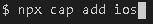
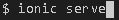

# 📑 FeedMe
## Contexto

En muchas empresas se realizan evaluaciones al personal sobre el desempeño en algún período de tiempo, a través de las cuales se realizan análisis para determinar la calidad del trabajo que se desarrolla dentro de la
organización.

Existen diversas maneras para obtener información acerca del desempeño realizado por algún trabajador, como lo son los comentarios que realizan los demás empleados sobre los resultados obtenidos dentro de la empresa.

Generalmente, los encargados de gestionar o llevar la evaluación de desempeño de los trabajadores son los supervisores de la empresa, donde cada supervisor posee una cantidad específica de trabajadores a su cargo.

Los problemas surgen al momento de tratarse de empresas muy grandes o supervisores con una gran cantidad de trabajadores a su cargo. La principal
consecuencia se puede observar en que los supervisores no pueden recordar el historial completo de desempeño de todos los trabajadores a su cargo, y solamente suelen recordar lo más reciente que sucede, generando un sesgo en
la evaluación de cada uno de los trabajadores.

La inestabilidad en los resultados del desempeño de los trabajadores, produce un descontento general en la empresa. Además de que los datos que
resultan de las evaluaciones no son los esperados, los supervisores se ven con la
tarea de llevar una carga adicional de trabajo, al llevar un registro de todo lo
que sucede en la empresa referente a los trabajadores a su cargo, durante los
ciclos de tiempo establecidos.

La solución es proporcionar una herramienta con las funcionalidades para solucionar estos sesgos de información.

# 📑 Tecnologías utilizadas

+ ### [Ionic](https://ionicframework.com/)
+ ### [Capacitor](https://capacitorjs.com/)
+ ### [Angular](https://angular.io/)
+ ### [Firebase](https://firebase.google.com/)
+ ### [Android Studio](https://developer.android.com/studio/?gclid=CjwKCAjwkJj6BRA-EiwA0ZVPVvJ8JbjUZ8vMZR7WxLUztMkdxgTqOuAhmIdfprN29xYVsx_I50KZvBoC5bsQAvD_BwE&gclsrc=aw.ds) (pruebas en android)
+ ### [Xcode](https://developer.apple.com/xcode/) (pruebas en Ios)

**Nota: Debe tener instaladas estos frameworks y plataformas para probar la aplicación**

# 📑 Pasos para ejecutar la aplicación

1. Una vez descargado los archivos del repositorio, debe agregar en la raiz del proyecto (src/app) la carpeta environments, que posee las claves de la base de datos. Esta carpeta se debe solicitar a los desarrolladores por motivos de seguridad.

2. Se deben tener instaladas las tecnologías mencionadas anteriormente. Consulte los links para saber cómo instalarlas.

3. Instale las dependencias del proyecto, para esto ejecute el siguiente  dentro de la carpeta del proyecto:

    

4. En caso de tener que auditar algun paquete utilice:

    

5. Realice el build de la aplicación, esto creará una carpeta con el nombre de "www".

    

6. Una vez terminado el build, cree las aplicaciones de Android y Ios con el siguiente comando:

    

    

7. Para iniciar la aplicación en la web, utilice el siguiente comando:

    

# 📑 Ejecutar en dispositivos móviles

Antes de ejecutar la aplicación en Android o Ios, debe realizar lo siguiente

1. Ejecute el siguiente comando

    

2. Luego, ejecute e los siguientes comandos dependiendo si desea ejecutar la aplicación en Android o Ios (debe haber agregado las carpetas de Ios y Android como se menciona anteriormente)

    
    

3. ejecute el siguiente comando para generar los iconos y splashScreen en sus carpetas nativas.

    

## Android

1. Para correr la aplicación en dispositivos Android debes tener instalado Android Studio.

2. Ejecute el siguiente comando:

    

3. Espere que Android Studio realice las configuraciones del proyecto y construya los gradle.

4. Conecte el dispositivo en su computador y procure que esté habilitada la depuración en el dispositivo.

5. Seleccione su dispositivo en Android Studio y ejecute la aplicación.

Para mayor información, consulte la guía de Josh Monroy sobre como generar la apk para hacer publicaciones en la Store
 https://www.joshmorony.com/deploying-capacitor-applications-to-android-development-distribution/

## Ios

**NOTA: Para ejecutar la aplicación en dispositivos Ios se requiere de una Mac que posea Xcode.**

1. Para correr la aplicación en dispositivos Ios debes tener instalado Xcode.

2. Ejecute el siguiente comando:

    

3. Espere que Xcode realice las configuraciones del proyecto y construya los gradle.

4. Conecte el dispositivo en su computador y procure que esté habilitada la depuración en el dispositivo.

5. Seleccione su dispositivo en Xcode y ejecute la aplicación.

Para mayor información, consulte la guía de Josh Monroy sobre como generar la apk para hacer publicaciones en la Store

https://www.joshmorony.com/deploying-capacitor-applications-to-ios-development-distribution/