# 📑 INFORME

## 📅 FECHA - 16 de agosto del 2020

## ***Setup y configuracion inicial del proyecto***
### **Objetivo:** Crear la configuracion del proyecto a traves del CLI, integrar las carpetas nativas de ios y android e instalar las dependencias de Capacitor.  

1. Creación de la estructura con el CLI de Ionic.

    

2. Instalamos Capacitor para utilizar los componentes de los dispositivos móviles a través de los plugins que ofrece el Framework.

    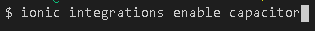

3. Inicializamos Capacitor con la información de la aplicación, que corresponde al "appName" y al "appId".

    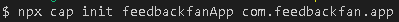

4. Hacemos el Build de nuestra aplicación, esto creará la carpeta "www".

    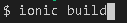

5. Agregamos las plataformas de Ios y Android que corresponden a los proyectos nativos.

    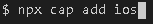

    

6. Se agrega al mismo nivel del root de la aplicación, las carpetas "informe" y "doc".

    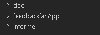

### Estructura Base del proyecto:

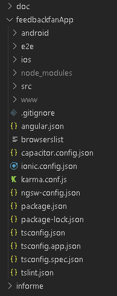

+ La carpeta ios y android, corresponden a las aplicaciones móviles nativas cofiguradas a través del webView.
+ La carpeta src contiene la aplicación HTML, CSS y JavaScript
+ Los archivos .JSON corresponden a configuraciones realizadas por el CLI de Ionic, como por ejemplo las dependencias de la aplicación.

## ***Estructura inicial de la Aplicación***
### **Objetivo:** Establecer carpetas, rutas y componentes básicos en la aplicación que serán de utilidad en todo el proyecto.
### **Consideraciones:** En este apartado se tomarán componentes de la plantilla asignada y se procederá a establecer una estructura de la aplicación siguiendo las mejores prácticas establecidas en la documentación de John Papa.   

### Estructura base de la carpeta src:
***NOTA: Esta configuracion inicial puede variar***

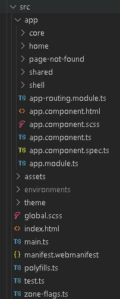

+ La carpeta Core contiene un modulo y funciona para establecer todos los servicios hacia las APIS externas, en este caso, todas las peticiones hacia Firebase. Su módulo se importa en el app.module para utilizarlo en cualquier parte de la aplicación.
+ La carpeta home es el componente que se carga al iniciar la aplicación. Este componente será modificado posteriormente.
+ La carpeta page-not-found contiene el módulo y las página que se va a establecer al momento de no conseguir alguna ruta especificada en la aplicación.
+ La carpeta shared va a contener alertas, notificaciones, pipes y otros componentes que se comparten entre todos los componentes y que pueden reutilizarse.
+ La carpeta shell, corresponde a una forma de crear esqueleto de precargado de los datos en la aplicación. Tambien posee el DataStore para hacer de una manera más fluida la obtención y envío de información sin necesidad de bloquear las funcionalidades de la aplicación mientras se espera por los datos.
+ La carpeta assets contiene iconos e imagenes estáticas de la aplicación, como por ejemplo la imagen que carga en page-not-found.
+ La carpeta environments contiene las variables de entorno y api Keys de la aplicación. **Por motivos de seguridad, esta carpeta no será publicada en el repositorio, debido a que es público**.
+ La carpeta theme, contiene información referente a los estilos scss globales de la aplicación.  

## 📅 FECHA - 17 de agosto del 2020
## ***Setup y configuracion inicial de Firebase***
### **Objetivo:** Configurar los servicios de autenticación de firebase, el servicio de Cloud Firestore para la base de datos y establecer la configuración entre el proyecto y los servicios necesarios de Firebase.  

### CONFIGURACIÓN DE FIREBASE - PLATAFORMA
1. Una vez en la consola del proyecto en Firebase, habilitamos el método de inicio de sesión por correo electrónico/contraseña. Esto va a permitir la autenticación por correo electrónico.

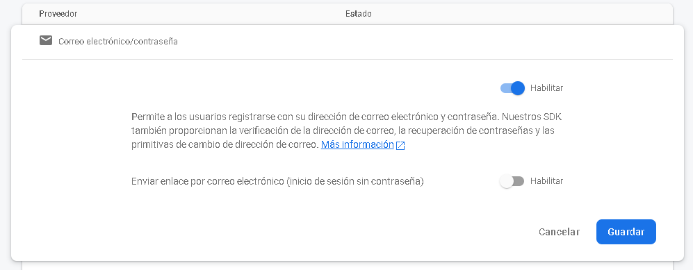

2. Configuramos Cloud Firestore para la capa de persistencia de la aplicación. Para esto establecemos su ubicación en us-central.

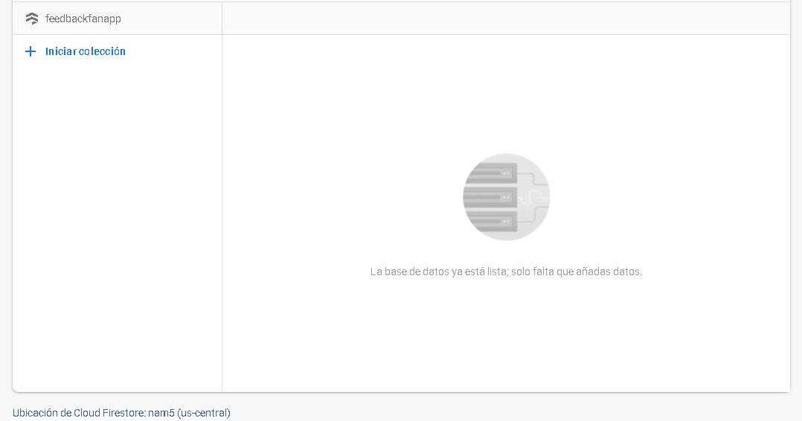

3. Establecemos las reglas de seguridad de la base de datos. En este caso como estamos en etapa de desarrollo, se permitirá agregar y leer documentos de la base de datos.

    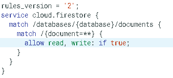

4. Configuramos la aplicación web en firebase para que nos asignen las claves y variables de acceso a los servicios.

    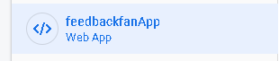

### CONFIGURACIÓN DE FIREBASE - APLICACIÓN
**Nota: Debemos tener instalado el CLI de Firebase de forma global**

1. Instalamos la libreria de AngularFire para conectar Firebase con la aplicación. Esta libreria tambien posee lo necsario para hacer las peticiones de autenticación y de Cloud Firestore.

    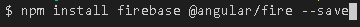

2. Agregamos las variables de entorno que nos proporciona Firebase en el environment.ts y environment.prod.ts. **Por motivos de seguridad, no se colocará una imagen en este apartado**

3. Accedemos a Firebase a través del siguiente comando.

    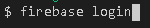

4. Iniciamos el proyecto de Firebase en la aplicación. Seleccionamos Firestore para utilizar los servicios de la base de datos.

    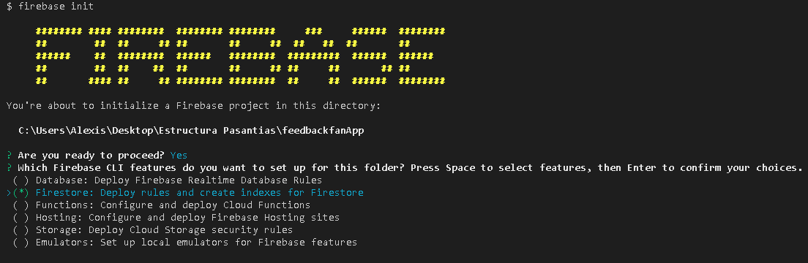

+ Esto creará los archivos de configuración para el proyecto, .firebaserc, firebase.json y firestore.indexes.json. El proyecto estará listo para utilizar los servicios de Firebase.

## ***Modelo no Relacional de la Base de Datos***
**NOTA: La siguiente imagen es una estructura inicial que se propone para representar la forma en que serán almacenados los datos en Firebase, siguiendo la documentación oficial y un esquema orientado a documentos.**

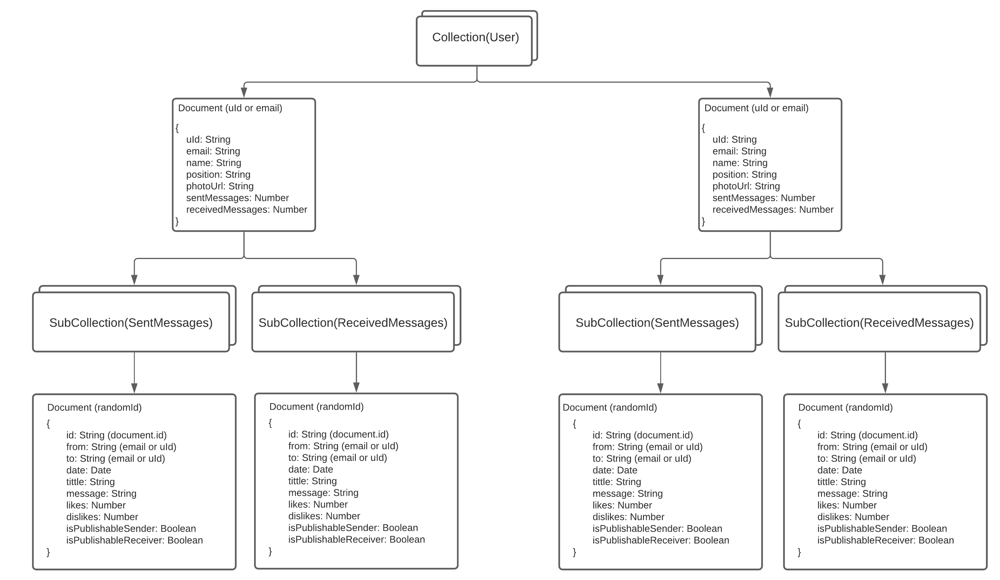